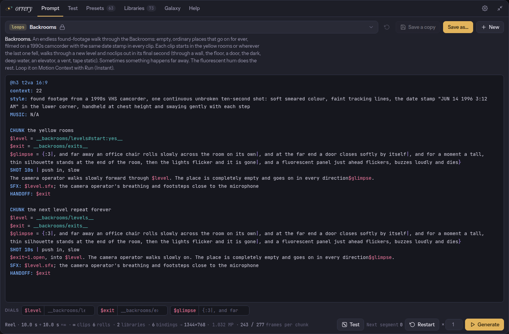

<div align="center">
  <picture>
    <source media="(prefers-color-scheme: dark)" srcset=".github/logo-dark.svg">
    <source media="(prefers-color-scheme: light)" srcset=".github/logo-light.svg">
    
  </picture>

  <h1>orrery</h1>
  <p>Endless prompt variety that learns your taste, from Krea stills to multi-clip MiniMax H3 videos, right inside ComfyUI.</p>
</div>

<div align="center">

[![License: MIT][license-shield]][license-url]
[![Version][version-shield]][version-url]
[![Python 3.13+][python-shield]][python-url]
[![ComfyUI custom node][comfyui-shield]][comfyui-url]
[![MiniMax H3][h3-shield]][h3-url]

</div>

<div align="center">
  <a href="#quick-start">Quick Start</a> &middot;
  <a href="#features">Features</a> &middot;
  <a href="#documentation">Docs</a> &middot;
  <a href="docs/h3.md">H3 guide</a> &middot;
  <a href="https://github.com/pyros-projects/orrery/issues/new">Report Bug</a>
</div>

<br>

---

<div align="center">
  
</div>

## Why orrery?

Wildcard generators roll blindly. You get variety, but you cannot tell which
choice made the image you loved, and the lists never get better. MiniMax H3
adds a second chore: its prompts are structured screenplays with timed shots,
camera moves, voices, sound, reference labels and continuity from one clip to
the next, and writing them by hand is slow and easy to get wrong.

If you prompt Krea 2, MiniMax H3 or any other model in ComfyUI and want every
run to be different, and a little better than the last, orrery is for you.

## Features

- **Learns your taste.** Rate outputs as love, like, nope or hate, and the
  choices behind them come up more or less often from then on.
- **Writes MiniMax H3 screenplays for you.** You write shots, camera moves,
  lines and sounds like a script; orrery turns them into H3's official prompt
  format and warns about what the model would ignore.
- **Makes videos that go on for ever.** Reels chain clips through H3 Motion
  Context, each clip opening where the last one ended; queue ten clips with
  one click, watch which one is rendering, restart from the top.
- **Ships a content pack worth pressing Generate for.** 68 presets and 878
  hand-written entries: drone odysseys, set changes, the Backrooms, a time
  machine, one-click random stills and clips, a creature test for H3.
- **Keeps random coherent.** The sound matches the place, the animal lands in
  a habitat it lives in, and a film look brings its own camera move and music.
- **Writes the lists you don't have.** Name a wildcard list that doesn't exist
  and a local language model creates it; edit lists in plain language and
  approve every change first.
- **Traces every output back.** Each output remembers its template, seed and
  every choice it rolled: re-run it exactly, or change one choice and keep the
  rest.
- **One node, a whole app.** Editor with syntax colours and completion, test
  rolls and frequency counts, a library editor and the rated gallery, inside
  ComfyUI.
- **Uses the wildcards you already have.** Dynamic Prompts syntax works as it
  is, and whole wildcard packs import with their cross-references intact.

## When to Use

| Situation | orrery? |
|---|---|
| You prompt image or video models in ComfyUI and want variety that improves with your ratings | Yes |
| You make MiniMax H3 videos, single scenes or long chains of clips | Yes |
| You have Dynamic Prompts or Civitai wildcard folders | Yes, they drop in |
| You want an image or video generator | No: orrery writes prompts, your models render them |
| You use H3 through a hosted API (MiniMax Hub, fal) | No: hosted endpoints rewrite prompts before the model sees them; orrery targets local ComfyUI |

## Quick Start

```bash
cd /path/to/ComfyUI/custom_nodes
git clone https://github.com/pyros-projects/orrery.git
```

Restart ComfyUI and add **orrery → Orrery Prompt**. Wire its `text` output into
your prompt input (and `width`, `height`, `length` into the latent for H3),
open a preset such as `@onebutton/clip` or `@loops/backrooms`, and press
**Generate**. **New** starts a blank H3 scene, reel, reference or keyframe
screenplay, or a Krea prompt, each with a quickstart in its comments.

## Install

### ComfyUI

Clone the repository into ComfyUI's `custom_nodes`, as in Quick Start. Its only
dependency, PyYAML, ships with ComfyUI. To keep the repository elsewhere, link
its `comfyui` folder instead:

```bash
ln -s /path/to/orrery/comfyui /path/to/ComfyUI/custom_nodes/orrery
```

```bat
mklink /J C:\path\to\ComfyUI\custom_nodes\orrery C:\path\to\orrery\comfyui
```

### Command line

```bash
cd orrery
uv sync                  # core: only PyYAML
uv sync --extra local    # + torch and transformers for a local language model
```

### Prerequisites

| Requirement | Notes |
|---|---|
| Python | 3.13+ |
| ComfyUI | tested with frontend 1.53 |
| MiniMax H3 nodes | only for video: Reference to Video, and Motion Context for reels |
| A language model | optional: a text encoder that is a whole LLM, such as Krea 2's `qwen3vl_4b`, lets the node write libraries and `--slots--` |

MiniMax H3's open weights are licensed outside the EU, the UK, South Korea and
the US; check the model's license for where you are. orrery itself ships no
model.

## Usage

### The template language

```text
$hero = __subjects/animals__
a photograph of $hero in a {misty|frozen:3} forest at dawn, 35mm film
```

```bash
uv run orrery expand '$hero = __subjects/animals__
a photograph of $hero in a {misty|frozen:3} forest at dawn, 35mm film' --seed 5 -n 3
```

| Syntax | Meaning |
|---|---|
| `__animal__`, `__film/genre__` | one entry from a library (a YAML or plain `.txt` wildcard file) |
| `__animal[feline]__`, `__characters/noir#gender:female__` | only entries with that tag or property |
| `{a\|b\|c:3}` | an inline choice, weighted (`{3::c\|a\|b}` works too) |
| `$hero = __animal__` | roll once, reuse everywhere |
| `$w.sfx` | a property of what was rolled: the sound follows the weather |
| `? $w.kind=rain,snow: …` | a line kept only when the condition holds |
| `@include effects/living_clay` | embed another preset, overriding its variables |
| `# a note` | a comment; it never reaches the model |

→ [The full language](docs/dsl.md): libraries, conditions, dependent filters,
variables you turn from outside, and importing wildcard packs.

### A MiniMax H3 screenplay

```text
@h3 t2va 16:9 0.6MP
style: live-action nature documentary, telephoto, crisp detail
$animal = __subjects/animals__

SHOT 5s | push in, small, slow
In __world/habitats#habitat:$animal.habitat__, $animal lifts its head and turns toward the sound of thunder.
NARRATOR (calm low voice, voiceover): Every storm is news out here.
SFX: $animal.sfx; distant thunder rolling in

SHOT 3s | cut, static
A close-up as the first heavy raindrops hit the ground around it.
SFX: rain beginning to fall
```

orrery writes the official H3 prompt from it: camera sentences, timestamps,
speaker IDs, `<d>` dialogue tags, the soundscape and the music field. `0.6MP`
sizes the canvas by area. The same file compiles on the command line with
`uv run orrery compile scene.orr --seed 7`.

→ [H3 screenplays](docs/h3.md): every mode (t2va, i2va, fl2va, l2va, ref2va),
casts of reference images and videos, and lint.

### An endless reel

```text
CHUNK the next room repeat forever
$room = __tour/rooms__
SHOT 10s | push in, slow
The door swings open and the camera glides into $room, and comes to rest facing a closed door.
HANDOFF: the camera rests squarely facing a closed door
```

Each run writes one clip. Wire `load_index` and `save_index` into Motion
Context's Load and Save Latent, set Generate to ×10, and the reel plays clip
after clip, every one opening on the frame the last one closed on.

## Documentation

| Guide | What is in it |
|---|---|
| [The prompt language](docs/dsl.md) | every construct, libraries and wildcard packs, variables you turn from outside |
| [H3 screenplays](docs/h3.md) | modes, casts, reels, the compiler's output and lint |
| [Presets and the content pack](docs/presets.md) | template references, saving presets, what ships built in |
| [The ComfyUI nodes](docs/comfyui.md) | outputs, the app's five tabs, Generate and Restart |
| [The wildcard manager](docs/wildcard-manager.md) | editing libraries in plain language, the language model in ComfyUI |
| [Configuration](docs/configuration.md) | the orrery home folder and model settings |

## How It Works

Every roll records which library entry or choice produced which words. Rating
an output multiplies the learned weight of each of its picks, and those
weights shape the next rolls. H3 screenplays pass through a scene model, so a
loved pick stays loved whether it became a Krea still or an H3 video.

→ [The design](docs/concept.md)

## Development

```bash
uv run pytest                                              # Python tests
node --test tests/js/app.test.mjs tests/js/complete.test.mjs   # the node app
uv run ruff check src tests
```

## Contributing

Issues and pull requests are welcome. Please run the tests above before you
open a pull request, and describe presets and library entries by what the
camera sees, not by artist or brand names.

## License

MIT, see [LICENSE](LICENSE). The libraries in `src/orrery/builtin/scp/` are
licensed differently: they are adapted from the SCP Wiki under CC BY-SA 3.0,
and every entry carries its article's citation.

## Acknowledgments

- [MiniMax H3](https://huggingface.co/MiniMaxAI) and its prompt guide, which
  the screenplay compiler follows
- [Dynamic Prompts](https://github.com/adieyal/sd-dynamic-prompts), whose
  wildcard syntax orrery speaks
- [ComfyUI-NO8D-controls](https://github.com/no8d/ComfyUI-NO8D-controls) (MIT),
  whose Krea style library the video looks were adapted from, and
  [OneButtonPrompt](https://github.com/AIrjen/OneButtonPrompt), which inspired
  the one-button presets
- ostris's 1,000-clip H3 style probe and hoodtronik's
  [style atlas](https://hoodtronik.github.io/minimax-h3-style-atlas/), which
  show what H3 renders
- The SCP Wiki authors credited in the `scp/` libraries
- Codie, for the continuity method behind the endless tours and the
  body-horror operators

---

Crafted with [Readme Craft](https://github.com/motiful/readme-craft)

[license-shield]: https://img.shields.io/badge/License-MIT-green.svg
[license-url]: LICENSE
[version-shield]: https://img.shields.io/badge/version-0.1.0-blue.svg
[version-url]: pyproject.toml
[python-shield]: https://img.shields.io/badge/python-3.13%2B-3776AB.svg
[python-url]: https://www.python.org
[comfyui-shield]: https://img.shields.io/badge/ComfyUI-custom%20node-5cc8c2.svg
[comfyui-url]: https://github.com/comfyanonymous/ComfyUI
[h3-shield]: https://img.shields.io/badge/MiniMax%20H3-screenplays-e2b45c.svg
[h3-url]: docs/h3.md
