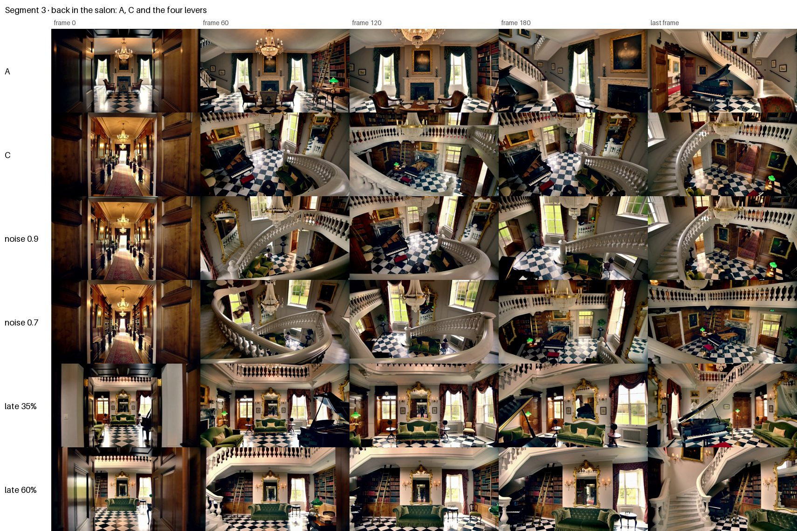

# Long H3 videos: the cast is the memory

The reels below are written in the words of their day. DSL 2.0 (#39, 2026-10-03) calls them
`SCENE` (`CHUNK`), `END ON:` (`HANDOFF:`), `CUT TO:` (`GOTO:`), `REMEMBER: … as` (`SEND: … to`),
`$x[-1]` (`$x~1`), `IF $x is …:` (`? $x[…]:`) and `always` (`global`); the earlier words still work.
See [h3.md](h3.md) 1d and 1e.

Status: agreed 2026-09-24. This is orrery's end stage. Built: R1 (Ref2VA), the reel (stage 4),
its memory lists and RefMods per clip (2026-10-02/03), and a reel that goes on from an input video
(2026-10-03). Open: the "recent" memory and making canon (#58). The engine is orrery's own Orrery
Continue / Orrery Film (Masked AV from H3 Continuum, since 2026-10-02); H3
Motion Context, which Pyro's workflow used before, and Contex Loop stay
options outside orrery. Sources: a design chat between Pyro and Codie
(a Garamonde virtual tour chained from 10 s clips with 1 s overlap), the
installed `ComfyUI-H3RefMods`, `comfyui-minimaxh3-contex-loop` and
`ComfyUI-H3-Motion-Context` packs, and the official full-reference guide.

## The problem

Chaining H3 clips with about one second of latent overlap gives smooth seams,
but the model only remembers what is inside that second. A room left thirty
seconds ago, a guest who walked out of frame, the house style: gone. The
common fix is bookkeeping in text: repeat a "continuity bible" in every
prompt, describe recurring things word for word, and hand each clip a
carefully worded opening state. It works, and it is exactly the kind of work
people get wrong by hand.

## Three memories, three owners

| Memory | Carries | Owner |
|---|---|---|
| Short term | the last ~1 s: position, motion, sound | the continuation nodes (Contex Loop, Motion Context): the latent tail |
| Long term | what places, people and the house look like | RefMods: packed reference tokens injected per chunk |
| Semantic | what happens next | the prompt, written by orrery |

RefMods need no labels in the prompt: they ride along as unnumbered reference
tokens, and H3 binds them to the text by description. So the prompt must still
describe whoever is present. Two text jobs remain: those descriptions and one
handoff sentence per seam. Both are mechanical once the screenplay knows who
and where each chunk is, so **the bookkeeper becomes the compiler**.

## The reel

```
@h3 ref2va 16:9 lite
style: live-action, cinematic, photorealistic
context: 22
LORA: <lora:minimax_h3_fl2va_turbo:0.5>

CAST
MAYA (refmod maya_canon): a young blonde woman, in a light-pink shirt
SALON (refmod salon_noir_canon): a double-height salon, with a curved staircase and a black grand piano

CHUNK the salon
SHOT 10s: tracking, slow
MAYA crosses SALON toward the staircase …
HANDOFF: the bottom of the curved staircase fills the lower foreground

CHUNK the library
LORA: <lora:Motion_Repair:1>
SHOT 7s: push in, small, slow
…
```

The whole reel expands once per run, so bindings and handoffs are the same in
every chunk; `segment` (from 0) picks the chunk.
Per chunk orrery emits (built):

- the prompt: the chunk's shots, the previous handoff as its opening sentence
  and its own handoff as its closing one;
- the length in frames: from the second chunk on, Shot 1 also covers the
  `context` frames the clip continues from, pinned and trimmed again (22);
- the `lora_stack` output: the `LORA:` lines before the first `CHUNK` plus the
  chunk's own, as a LORA_STACK;
- the picks of the head, the chunk and its handoffs only, so ratings teach the
  gallery what was in the clip;
- `--…--` slots written by the language model, which from the second segment
  on watches the previous clip from the chain (one frame a second and the
  last one): the semantic memory grounded in what H3 actually rendered, not
  only in what was asked for.

Built (2026-09-25): **Orrery Refs** routes the reference images per chunk. Wire
every image as `image_N` (N as in the CAST's `(image N)`) and the prompt's
`picks`; each clip gets only the images its CAST uses, packed as `ref_1`,
`ref_2` …, and the prompt node, seeing the router in its graph, renumbers
`<Picture N>` to match (Reference to Video counts only the images wired). The
node also reads its graph for R2: it warns when the Reference to Video its text
reaches has fewer reference images wired than the clip uses. The tutorial:
[orrery-refs.md](orrery-refs.md).

Built (2026-09-30): **`SEND:`** anchors identity across a reel. Inside a
`CHUNK`, `SEND: frame 0 to image 3` (or `frames 2, 5, 34-46`) makes those frames
of that chunk's clip, as the chain keeps it, reference `image 3` for every
later clip, with or without a CAST naming it; bound in the CAST
(`GIRL (image 1, image 3)`), the prompt says whose picture it is, and each later
clip sees how she looked when the reel began instead of a copy of a copy. Orrery Refs
fetches the frames from the reel's chain, in the folder orrery names after it; before the
sending clip exists, the image is left out of the clip. Details in
[h3.md](h3.md#1d-reels-chunk).

Built (2026-10-01): the Prompt tab marks every `CHUNK` with its segments, its
place in the film and the runtime left, highlights the chunk the next segment
plays (**Jump** goes there), and shows a timeline of the chain's clips and the
sent anchors beside the editor ([comfyui.md](comfyui.md)).

Built (2026-10-02): **orrery's own continuation** ([plan](plan-continuation.md),
[comfyui.md](comfyui.md)). Orrery Continue starts each clip after the first with
the last 22 frames of the one before, picture and sound, held by a
`noise_mask` (Masked AV, taken from H3 Continuum, MIT, with attribution); Orrery
Film trims them, keeps one take per segment and joins the film. It replaces
Motion Context's six nodes and needs no model or layout patch. The previous
clip, `SEND:` and the timeline read Orrery Film's takes, or Motion Context's
Chain Video, whichever was written last.

Built (2026-10-02): the **memory list** per chunk. A clip keeps the CAST members
it names and the `global` ones, with their RefMods, and leaves the others out, so
the retrieval query for this RefMod-RAG is the screenplay itself. **Orrery RefMods** puts them on the
conditioning, each with a strength (`at 0.5`, an attention bias orrery wraps
around H3) and a start (`from 35%`, a timestep range), see
[h3.md](h3.md#1e-refmods-refmod-name-at-05-from-35). Still open: the "recent"
memory (a RefMod of the chunk before), and making canon from the gallery.

Wiring: Orrery `picks` → Orrery Continue, with the H3 node's latent (and
conditioning) on their way to the sampler, and the sampled latent with the
decoded clip into Orrery Film (orrery counts the segments itself); `text` →
Reference to Video `prompt`; `length` → its `length`;
the model through the Orrery Prompt (loader → `model` → sampler) puts the `LORA:` lines on it; or
`lora_stack` → the `lora_stack` input of Lora Loader (LoraManager) or any
other stack loader. Queue with a Run count of the reel's clips (the stats line
shows it), or Run (Instant) for `repeat forever`; the Orrery seed stays fixed
(the node does that for a reel). `CHUNK … repeat N|forever` and `$x~N` make
loops such as `fashion/runway_loop`.

```
reel ──orrery──▶ Contex Loop plan (prompts, lengths, seeds)
          └────▶ memory lists ──▶ Orrery Memory Router (inside the loop, loads RefMods per chunk)
                                        │
H3 ──▶ Review Gate / Gallery ♥ ──▶ "make canon" ──▶ new RefMod ──▶ CAST entry
```

- **Contex Loop stays the engine.** It already does seams, review, retry,
  checkpoints and resume. Its plan is plain JSON (`prompt_prefix`, `shots[]`
  with `prompt`, `duration_seconds`, `seed`), so orrery writes it.
- **The missing piece is a per-chunk memory router.** Contex Loop takes
  references as global graph inputs; switching them per scene needs a node that
  reads the current shot and applies that chunk's RefMods.
- **Love makes canon.** A loved chunk can turn what H3 actually generated into
  the canonical RefMod of a place or person. The canon picker asks for varied
  angles (wide, reverse, detail), because RefMods built from near-identical
  frames teach composition instead of identity.

## Facts that shape the design

- RefMods are unmasked extra tokens: every frame of a chunk sees every RefMod.
  Memory is per chunk, not per second; a chunk that walks from one room into
  the next carries both.
- Tokens are not free: an encode-mode still costs about 1,280 tokens, a 16×16
  grid 64 per frame, against roughly 55,000 for a 15 s chunk. orrery should
  lint a per-chunk budget.
- RefMods do not disentangle identity, clothing and background. Retrieval must
  stay selective: global, the present cast, maybe recent. Never everything.
- Contex Loop's resume hash ignores references; change its
  `generation_fingerprint` when memories change.
- With a latent tail, handoffs may end mid-action (Contex Loop's advice); the
  text handoff keeps the prompt consistent with what the tail shows.

## Stages

1. **R1, Ref2VA compiler (now):** `CAST` as a general memory declaration
   (name, description, sources: `image N`, `video N`, `audio N`,
   `refmod NAME`), labels computed the way the Ref2VA node numbers its inputs,
   all six sections, lint. In the base modes, cast names expand to their
   descriptions, which is already the prompt half of RefMod memory.
2. **R2, the node knows its wiring:** walk the graph from `text` to the Ref2VA
   node (through any text nodes) and check the declared sources against what is
   connected. Declarations stay the source of truth.
3. **R3, the cast describes itself:** Qwen3-VL (Krea 2's text encoder) writes a
   member's description from its reference image.
4. **Reel (built; Orrery Continue / Orrery Film):** `CHUNK`,
   `HANDOFF`, `LORA:`, `context:`, the `segment` input, and the memory lists.
5. **Memory router (built) and canon (open):** Orrery RefMods puts each clip's
   RefMods on it, with a strength, a start and an end, also those made from the
   reel's own frames; "make canon" from the gallery is still open.

## The experiment before stages 4 and 5

Everything above rests on one hypothesis: a RefMod built from an early chunk
brings a place back many chunks later without dragging its composition along.
Test it by hand with the installed H3RefMods (Codie's A/B/C):

| Run | Latent tail | Recent RefMod | Place/global RefMod |
|---|---|---|---|
| A | ✓ | | |
| B | ✓ | ✓ | |
| C | ✓ | ✓ | ✓ |

Same seed and prompt; judge room identity, material drift, recurring objects,
seam quality and composition leakage. Build the RefMods from stills: the
installed pack trims a video reference to 4k+1 frames, while H3's own Reference
to Video trims to 17k+5 (checked in both sources, 2026-10-02); "Create From
Inputs" cannot save, "From Folder" can. The setup, the workflows and the run
sheet are in [experiments/refmod-abc/](../experiments/refmod-abc/run_sheet.md).

### What it showed (2026-10-02 and 03)

Run locally on an RTX 4090 with a 4-step turbo LoRA, seed 7. A four-chunk tour
(salon, hallway, library, back in the salon from the other side). Segment 3 is
the one that decides, scored from 1 to 5 (leakage 5 = none):

| Segment 3, back in the salon | Identity | Leakage | Time |
|---|---|---|---|
| A, the latent tail only | 2 | 5 | 99 s |
| B, plus a recent RefMod (the chunk before) | 1 | 1 | |
| C, plus a place RefMod (four stills of chunk 1), from 0% | 5 | 1 | 107 s |
| C with the model's condition noise 0.9 | 5 | 2 | 114 s |
| **C from 35% of sampling on** | **4** | **4** | **104 s** |
| C from 60% | 4 | 4 | 102 s |



- **The place RefMod works, but from the first step it is too literal.** It
  brings back every object of the salon and chunk 1's framings with them.
  Starting it at 35% keeps the salon and lets go of the framing, at no extra
  cost: the first steps carry no RefMod tokens.
- **The automatic recent RefMod fails.** B copies the clip before: B3 repeats
  B2 almost frame for frame.
- **A character needs the first steps.** Jinx's RefMod from 35% did not come
  through at all; from 0% she was unmistakable
  ([sheet](../experiments/refmod-abc/results/jinx/start_35_vs_0.jpg)). With 4
  steps the start is a coarse dial; at 20 steps the thresholds may move.
- **Cost:** 576 tokens per still at 0.6 MP. C (seven stills, 4,032 tokens)
  was 3 to 10 s slower per clip. Peak VRAM stayed under 23 GB.
- **The pack's own strength only blurs a RefMod.** orrery's strength works
  through an attention bias instead (#30).

**Decision: go.** The RefMod memory is in v1:
- each clip gets the RefMods of the CAST members it names, plus the `global` ones;
- RefMods start at 0% by default (characters), and a place takes `from 35%`;
- each has a strength, a start and an end (`at`, `from`, `to`, or
  `SET: name(1, 0%, 10%)`).
- The automatic recent memory did not earn a place. It comes in as an explicit
  choice instead: `SEND: every 10 frames to refmod NAME` makes a RefMod from a
  clip's own frames, for the clips after it.

The rounds with every sheet are in the comments of
[#4](https://github.com/pyros-projects/orrery/issues/4).
